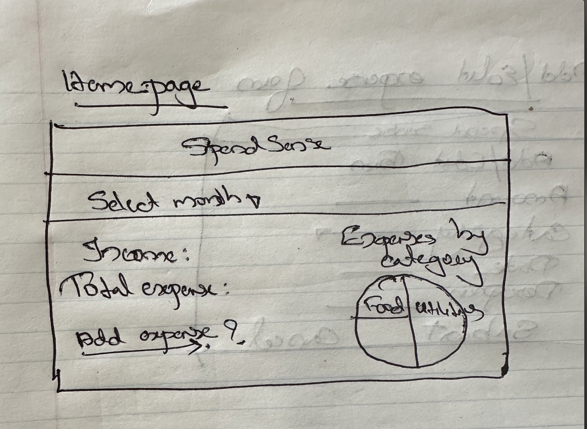
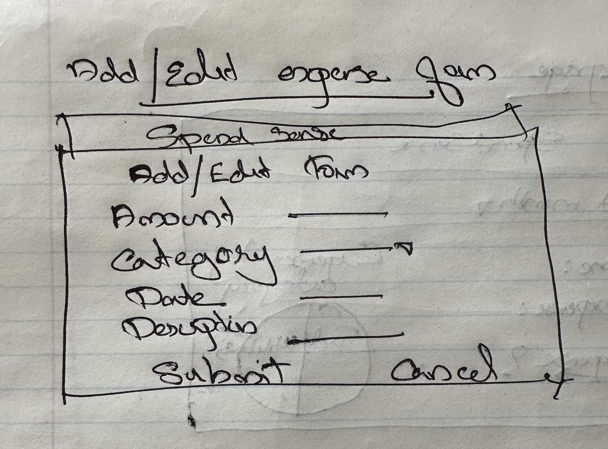
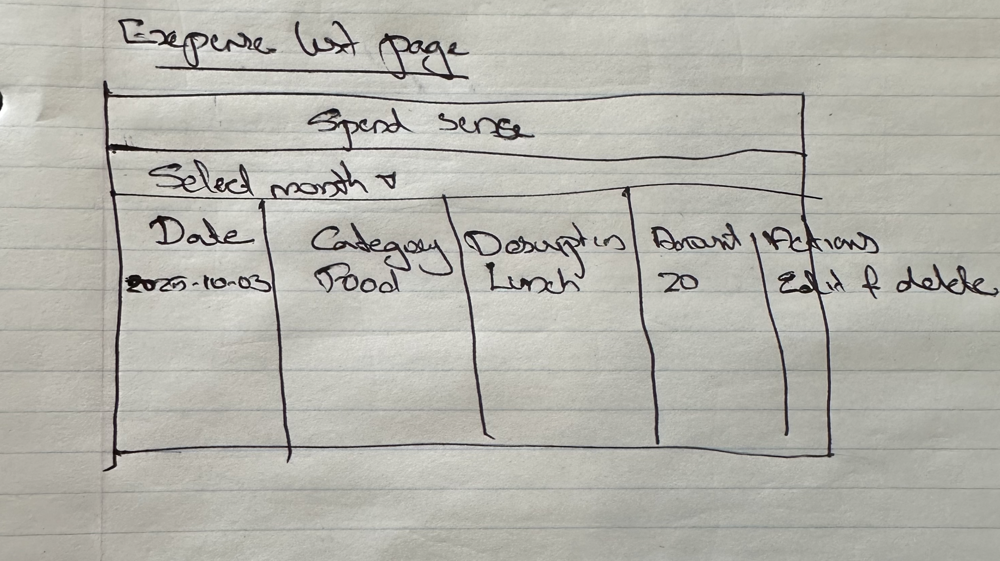

# Project Title

SpendSense - A personal montly expense calculator

## Overview

SpendSense is a web application which help the users to track the personal expenses against a fixed income. The app allows users to add, edit and delete expenses and calculate their remaining balances after deducting expenses from their income.

### Problem Space

Almost every people rely on card for spending, which often makes it hard to track how much money are they actually spending. In the past when the people use physical cash, it was easier to see where money was going. This app solves that problem by offering a centralized platform to track expenses, categorize them, and calculate the remaining balance after all expenditures, helping users manage their finances more effectively.

### User Profile

-Individuals who want to track their expenses and manage the finance better

### Features

As a user, I want to login to the app
As a logged in user, I want to view summary of a month's expense and savings
As a logged in user, I want to add a new expense with details like amount category and date
As a logged in user, I want to edit the details of an existing expense
As a logged in user, I want to delete the expense if not needed in the list
As a logged in user, I want to view the remaining balance in my income
As a logged in user, I want to logout from application

## Implementation

### Tech Stack

Frontend:
React
SCSS
Axios
Client libraries:
react
react-router

Backend:
Express.js
Knex.js
Database:
MySQL

### APIs

- No external APIs will be used for the first sprint

### Sitemap

-Homepage :- Displays the income, total expenses, and remaining balance and a link to add an expense form page. It has a pei-chart the displays the expense, income and savings.

-Add Expense Form :- This form allows user to add expense record by filling the following fields
Amount
Category(drop-down with options)
Date
Description
A submit button to save the record into database
A cancel button to return to the homepage

-Expense list page :- Displays a list of all expenses with options to edit or delete.
A table like layout displaying all expenses in row
Clicking on edit will go to edit form page
Clicking on delete will delete the record

### Mockups





### Data

Databases

1. Users Table (ID, Email, Password) - ID is primary key
   
2. Categories Table (ID, Name) - ID is primary key
   
3. Expenses Table (ID, amount, date, description, Categories_ID, Users_ID) - ID is primary key, Categories_ID and Users_ID are foreign key referncing Categories and Users table respectively
   
4. Income Table (ID, amount, month, User_ID) - ID is primary key and User_ID references the Users table
   

### Endpoints

Categories API
GET /api/categories : Return an array of categories
Response Body Example

```
[
    {
        "id": 1,
        "name":"Food"
    },
     {
        "id": 2,
        "name":"Transportation"
    },
    ...
]

Expenses Table
GET /api/expenses
Query Parameters
User_ID: to fetch all the expenses of a user

Response Body Example

[
    {
        "id": 1,
        "amount":30,
        "date":"2025-03-12,
        "description:"Bus and train fare to office,
        "Category_ID":2,
        "User_ID":1
    },
      {
        "id": 1,
        "amount":120,
        "date":"2025-03-01,
        "description:"Lunch",
        "Category_ID":1,
        "User_ID":1
    },
    {
        "id": 1,
        "amount":120,
        "date":"2025-02-11,
        "description:"Dinner",
        "Category_ID":1,
        "User_ID":1
    },
    ...
]

GET /api/expenses
Query Parameters:-
User_ID: to fetch all the expenses of a user
month:First day of month, to fetch only that month's records

Response Body
[
    {
        "id": 1,
        "amount":30,
        "date":"2025-03-12,
        "description:"Bus and train fare to office,
        "Category_ID":2,
        "User_ID":1
    },
      {
        "id": 1,
        "amount":120,
        "date":"2025-03-01,
        "description:"Lunch",
        "Category_ID":1,
        "User_ID":1
    },
    ...
]

POST /api/expenses :- adds a new expense

Request Body
    {
        "amount":30,
        "date":"2025-03-12,
        "description:"Bus and train fare to office,
        "Category_ID":2,
        "User_ID":1
    }

Response Body
    {
        "id":1
        "amount":30,
        "date":"2025-03-12,
        "description:"Bus and train fare to office,
        "Category_ID":2,
        "User_ID":1
        "created_at" :"2023-10-05T00:00:00.000Z"
    }

PUT /api/expenses/:id :- Update an existing expense
Parameter: id of expense

Request body
    {
        "amount":50,
        "date":"2025-03-12,
        "description:"Bus and train fare,
        "Category_ID":2,
    }
Response Body
    {
        "id":1
        "amount":30,
        "date":"2025-03-12,
        "description:"Bus and train fare to office,
        "Category_ID":2,
        "User_ID":1
        "created_at" :"2023-10-05T00:00:00.000Z"
    }

GET /api/expenses/:id :- get an expense by its id
Parameter: id of expense
Response body
    {
        "id": 1,
        "amount":30,
        "date":"2025-03-12,
        "description:"Bus and train fare to office,
        "Category_ID":2,
        "User_ID":1
    }

DELETE /api/expenses/:id :- Deletes the expense specified by ID
Parameter:- id of expense
Response body
    {
        "message": "Successfully deleted"
    }

Fetch total expenses of a user
GET /api/expenses/total
Response body
    {
        "totalExpenses": 5000
    }

Fetch Summary of a month for a user
GET /api/dashboard/summary
Response body
    {
    "totalExpense": 4320,
    "totalIncome": 6000,
    "savings": 1680
    }

POST /login: to login to application
Request body
    {
        "email": "sherinanooj@gmail.com
        "password" :"abc123"
    }
Response body
    {
        "success": true,
        "user": {
            "id": 1,
            "email": "sherinanooj@gmail.com"
        }
    }


## Roadmap

- Create client

  - react project with routes and boilerplate pages

- Create server

  - express project with routing, with placeholder 200 responses

- Create migrations
- Create seeds with sample records

- Implement the Expenses API (GET, POST, PUT, DELETE).
-Implement categories API
-Implement the summary API

## Future Implementations
User Signup
Implement category wise summary display
Allow users to set up recurring income and expenses like Wage, Rent etc
Integrate an Open AI GPT model APIs to generate personalized financial suggestions based on the summary and categories sum.

```
